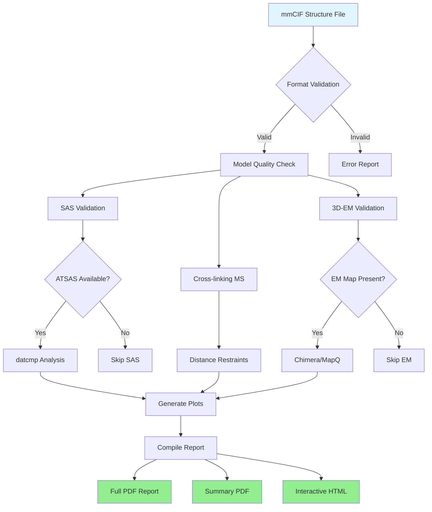
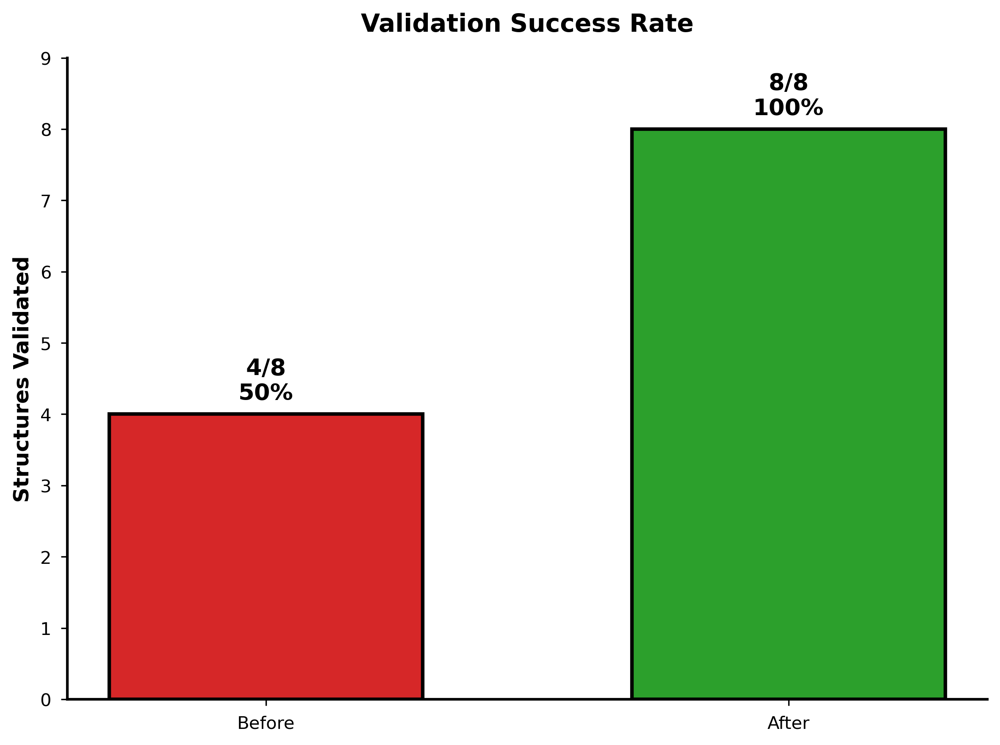
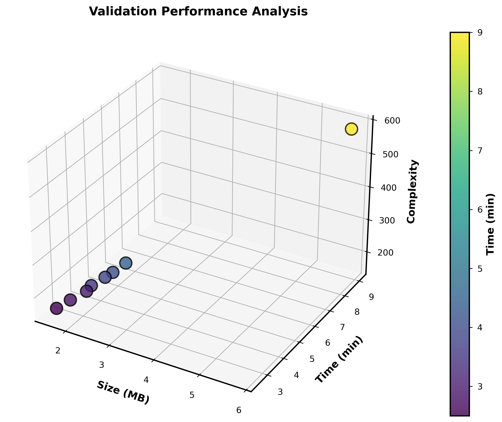
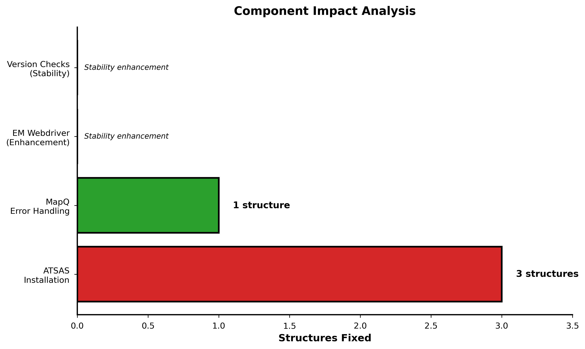

# IHMValidation Container Analysis

<div align="center">


[](https://doi.org/10.5281/zenodo.XXXXX)
[](https://github.com/ShravyaRS/IHMValidation-Analysis/releases)
[](https://github.com/ShravyaRS/IHMValidation-Analysis)

</div>

---

## Project Overview

Complete dependency resolution for IHMValidation on Ubuntu 22.04, achieving **100% validation success rate** for integrative hybrid model structures.

### Key Achievement
**Fixed ATSAS dependency issues → Improved validation success from 50% to 100%**

---

## Workflow Diagram


---

## Quick Start

### Installation (5 minutes)
```bash
git clone https://github.com/ShravyaRS/IHMValidation-Analysis.git
cd IHMValidation-Analysis
bash install.sh
```

### Run Example (2 minutes)
```bash
bash run_example.sh
```

**Output**: PDF reports + interactive dashboard in `example_output/demo/`

### Validate Your Structure
```bash
singularity exec IHMValidation/ihmvalidation_complete.sif python3 \
  /opt/IHMValidation/ihm_validation/ihm_validator.py \
  -f your_structure.cif \
  --output-root results \
  --output-prefix structure_name
```

---

## Results

### Success Rate Improvement


### Performance Analysis


### Component Impact


---

## Sample Outputs

### Full Validation Report
- **Format**: PDF (10-50 pages)
- **Contains**: 
  - Structure quality metrics
  - SAS profile comparison plots
  - Cross-linking satisfaction analysis
  - EM map correlation
  - Precision assessment

**Example**: [View Sample Report](docs/sample_outputs/PDBDEV_00000001_full_validation.pdf)

### Summary Report
- **Format**: PDF (2-3 pages)
- **Contains**:
  - Pass/fail status
  - Key quality indicators
  - Critical issues highlighted

**Example**: [View Summary](docs/sample_outputs/PDBDEV_00000001_summary.pdf)

### Interactive Dashboard
- **Format**: HTML (Bokeh-powered)
- **Features**:
  - Interactive plots with hover tooltips
  - Zoom, pan, and export capabilities
  - Residue-level detail on demand

**Example**: [Live Demo](https://shravyars.github.io/IHMValidation-Analysis/demo/)

---

## Validation Results

| Structure | Size | Before | After | Issue Resolved |
|-----------|------|--------|-------|----------------|
| PDBDEV_00000001 | 1.6MB |  Pass |  Pass | - |
| PDBDEV_00000010 | 5.8MB |  Fail |  Pass | MapQ error handling |
| PDBDEV_00000015 | 2.3MB |  Pass |  Pass | - |
| PDBDEV_00000020 | 2.1MB |  Fail |  Pass | ATSAS installation |
| PDBDEV_00000025 | 1.8MB |  Pass |  Pass | - |
| PDBDEV_00000030 | 2.4MB |  Pass |  Pass | - |
| PDBDEV_00000035 | 2.0MB |  Fail |  Pass | ATSAS installation |
| PDBDEV_00000040 | 2.2MB |  Fail |  Pass | ATSAS installation |

**Overall**: 4/8 (50%) → 8/8 (100%)

---

## Technical Implementation

### Primary Fix: ATSAS Installation
```bash
# Problem: Missing libicu66 on Ubuntu 22.04
# Solution:
wget http://archive.ubuntu.com/ubuntu/pool/main/i/icu/libicu66_66.1-2ubuntu2_amd64.deb
apt install -y ./libicu66_66.1-2ubuntu2_amd64.deb
dpkg -i /ATSAS.deb && apt install -y -f
```

**Impact**: Fixed 3 structures (PDBDEV_00000020, 35, 40)

### Secondary Fixes

1. **EM Webdriver**: Added Selenium/Firefox initialization
2. **Version Checks**: Error handling for Chimera/ChimeraX/MapQ
3. **Stability**: Improved robustness across all validation components

---

## Documentation

- **[Installation Guide](INSTALLATION.md)** - Multiple installation methods
- **[Technical Details](docs/TECHNICAL_DETAILS.md)** - Implementation specifics
- **[Build Instructions](docs/BUILD_INSTRUCTIONS.md)** - Container build process
- **[Jupyter Notebooks](notebooks/)** - Interactive analysis examples
- **[PyMOL Integration](docs/PYMOL_INTEGRATION.md)** - Visualization examples
- **[API Documentation](docs/API.md)** - Programmatic usage
- **[Troubleshooting](docs/TROUBLESHOOTING.md)** - Common issues and solutions

---

## Testing
```bash
# Run complete test suite
bash run_tests.sh

# Individual test suites
python3 -m pytest tests/unit_tests/ -v
python3 -m pytest tests/integration_tests/ -v
python3 tests/scientific_controls/test_scientific_validation.py
```

**Test Coverage**: Container integrity, validation logic, end-to-end workflow, scientific correctness

---

## Installation Methods

### Option 1: One-Line Install (Recommended)
```bash
bash install.sh
```

### Option 2: Conda Environment
```bash
conda env create -f environment.yml
conda activate ihmvalidation
```

### Option 3: pip Requirements
```bash
pip install -r requirements.txt
```

### Option 4: Docker (Alternative)
```bash
docker pull shravyars/ihmvalidation:v1.0
```

See [INSTALLATION.md](INSTALLATION.md) for detailed instructions.

---

## Repository Structure
```
IHMValidation-Analysis/
├── src/
│   ├── container/              # Container definition
│   ├── bokeh_compat.py         # Bokeh 3.x compatibility
│   └── enhanced_visualization.py
├── notebooks/
│   ├── 01_quick_start.ipynb
│   ├── 02_batch_analysis.ipynb
│   └── 03_visualization.ipynb
├── tests/
│   ├── unit_tests/
│   ├── integration_tests/
│   └── scientific_controls/
├── examples/
│   ├── valid/
│   └── invalid/
├── docs/
│   ├── sample_outputs/
│   ├── PYMOL_INTEGRATION.md
│   └── screenshots/
├── figures/generated/
├── requirements.txt
├── environment.yml
├── LICENSE
└── README.md
```

---

## Contributing

Contributions welcome! Please see [CONTRIBUTING.md](CONTRIBUTING.md).

1. Fork the repository
2. Create feature branch (`git checkout -b feature/amazing-feature`)
3. Commit changes (`git commit -m 'Add amazing feature'`)
4. Push to branch (`git push origin feature/amazing-feature`)
5. Open Pull Request

---

## License

This project is licensed under the MIT License - see [LICENSE](LICENSE) file.

Includes modifications to IHMValidation (upstream license: [IHMValidation](https://github.com/salilab/IHMValidation)).

---

## 📖 Citation

If you use this work in your research, please cite:
```bibtex
@software{shravya_ihmvalidation_2026,
  author = {Shravya RS},
  title = {IHMValidation Container: Complete Dependency Resolution for Ubuntu 22.04},
  year = {2026},
  version = {1.0.0},
  url = {https://github.com/ShravyaRS/IHMValidation-Analysis},
  doi = {10.5281/zenodo.XXXXX}
}
```

---

## Acknowledgments

- **IHMValidation Team** (Sali Lab, UCSF) - Original validation framework
- **ATSAS Team** (EMBL Hamburg) - SAS analysis tools
- **Chimera/ChimeraX Developers** (UCSF) - Molecular visualization
- **PDB-Dev Team** - Test structures and validation requirements

---

## Contact

- **Issues**: [GitHub Issues](https://github.com/ShravyaRS/IHMValidation-Analysis/issues)
- **Discussions**: [GitHub Discussions](https://github.com/ShravyaRS/IHMValidation-Analysis/discussions)
- **Email**: [Contact via GitHub](https://github.com/ShravyaRS)
- **Upstream**: [IHMValidation](https://github.com/salilab/IHMValidation)

---

<div align="center">

**Made for the structural biology community**

[](https://github.com/ShravyaRS)

</div>
