# IHMValidation Container Analysis

A comprehensive solution for IHMValidation dependency issues on Ubuntu 22.04, achieving 100% validation success rate.


## Overview

IHMValidation is a framework for validating integrative hybrid models submitted to PDB-Dev. This project addresses critical dependency failures that prevented 50% of structures from validating successfully on Ubuntu 22.04 systems.

### Problem Statement

The ATSAS package (required for Small Angle Scattering validation) failed to install via standard package managers on Ubuntu 22.04, causing validation failures for all structures containing SAS data.

### Solution

A complete Singularity container with dependency resolution, error handling, and validation improvements that achieves 100% success rate across diverse test structures.

## Key Results

| Metric | Before | After | Improvement |
|--------|--------|-------|-------------|
| Success Rate | 50% (4/8) | 100% (8/8) | +50 percentage points |
| ATSAS Status | Missing | Functional | Fixed |
| EM Validation | Unstable | Stable | Fixed |

## Installation

### Prerequisites

- Ubuntu 22.04 or compatible Linux distribution
- Singularity/Apptainer 3.8 or higher
- 10GB free disk space
- 4GB RAM minimum (8GB recommended)
- sudo privileges for container build

### Quick Start
```bash
git clone https://github.com/ShravyaRS/IHMValidation-Analysis.git
cd IHMValidation-Analysis
sudo bash install_complete.sh
```

Build time: 30-45 minutes

## Usage

### Basic Validation
```bash
singularity exec IHMValidation/ihmvalidation_complete.sif python3 \
  /opt/IHMValidation/ihm_validation/ihm_validator.py \
  -f structure.cif \
  --output-root validation_output \
  --output-prefix structure_name
```

### Example
```bash
singularity exec IHMValidation/ihmvalidation_complete.sif python3 \
  /opt/IHMValidation/ihm_validation/ihm_validator.py \
  -f test-data-extended/PDBDEV_00000001.cif \
  --output-root results \
  --output-prefix PDBDEV_00000001
```

Output files:
- `results/PDBDEV_00000001/PDBDEV_00000001_full_validation.pdf`
- `results/PDBDEV_00000001/PDBDEV_00000001_summary_validation.pdf`
- `results/PDBDEV_00000001/PDBDEV_00000001_htmls.zip`

## Analysis Workflow
```
Input: structure.cif
    |
    v
[Format Validation]
    |
    v
[Model Quality Assessment]
    |
    v
[SAS Validation] (ATSAS/datcmp)
    |
    v
[Cross-linking MS Validation]
    |
    v
[3D-EM Validation] (Chimera/MapQ)
    |
    v
[Precision Analysis] (PrISM)
    |
    v
Output: PDF reports, HTML visualizations
```

## Technical Implementation

### Issues Resolved

**1. ATSAS Installation**
- Problem: Missing libicu66 dependency on Ubuntu 22.04
- Solution: Manual dependency installation via dpkg
- Impact: Fixed 3 structures (PDBDEV_00000020, 35, 40)

**2. EM Webdriver Initialization**
- Problem: Selenium webdriver not initialized for Bokeh plots
- Solution: Added Firefox headless webdriver configuration
- Impact: Enhanced visualization reliability

**3. Version Check Error Handling**
- Problem: Chimera/ChimeraX/MapQ version detection crashes
- Solution: Implemented try-except blocks with default versions
- Impact: Fixed PDBDEV_00000010 (large EM structure)

### Container Components

- Base: Ubuntu 22.04 LTS
- Python: 3.10 (Miniconda)
- ATSAS: 3.0.3-1 with libicu66
- Chimera: 1.19 with MapQ plugin
- ChimeraX: 1.11
- IMP: Integrative Modeling Platform
- MODELLER: 10.5

## Validation Results

| Structure ID | Size | Type | Before | After |
|--------------|------|------|--------|-------|
| PDBDEV_00000001 | 1.6MB | SAS + CX-MS | Pass | Pass |
| PDBDEV_00000010 | 5.8MB | EM (large) | Fail | Pass |
| PDBDEV_00000015 | 2.3MB | Quality | Pass | Pass |
| PDBDEV_00000020 | 2.1MB | SAS | Fail | Pass |
| PDBDEV_00000025 | 1.8MB | CX-MS | Pass | Pass |
| PDBDEV_00000030 | 2.4MB | Multi-tech | Pass | Pass |
| PDBDEV_00000035 | 2.0MB | SAS + Quality | Fail | Pass |
| PDBDEV_00000040 | 2.2MB | Complex | Fail | Pass |

## Repository Structure
```
IHMValidation-Analysis/
├── README.md                        # This file
├── LICENSE                          # MIT License
├── requirements.txt                 # Python dependencies
├── install_complete.sh              # Automated build script
├── src/
│   └── container/
│       ├── Singularity.def          # Container definition
│       └── patch_em_properly.py     # Runtime patches
├── data/
│   └── test-structures/             # Sample test data
├── reports/
│   └── validation-results/          # Example outputs
├── figures/
│   ├── workflow-diagram.md          # Process flowchart
│   └── architecture-diagram.md      # System architecture
└── docs/
    ├── TECHNICAL_DETAILS.md         # Implementation details
    ├── BUILD_INSTRUCTIONS.md        # Manual build guide
    └── CONTRIBUTING.md              # Contribution guidelines
```

## Performance Metrics

| Metric | Value |
|--------|-------|
| Container Size | 5.5GB (compressed SIF) |
| Build Time | 30-45 minutes |
| Small Structure (<2MB) | 2-3 minutes |
| Medium Structure (2-4MB) | 4-6 minutes |
| Large Structure (>5MB) | 8-10 minutes |
| Memory Usage | 2-4GB typical, 6GB peak |

## Dependencies

See `requirements.txt` for complete Python package list.

Key dependencies:
- numpy==1.26.2
- scipy>=1.6.1
- matplotlib>=3.4.0
- ihm==2.7
- selenium (for webdriver)
- bokeh (for visualizations)

## Documentation

- [Technical Details](docs/TECHNICAL_DETAILS.md) - Complete implementation details
- [Build Instructions](docs/BUILD_INSTRUCTIONS.md) - Step-by-step build guide
- [Contributing Guidelines](docs/CONTRIBUTING.md) - How to contribute
- [Workflow Diagram](figures/workflow-diagram.md) - Visual process flow
- [Architecture Diagram](figures/architecture-diagram.md) - System architecture

## License

MIT License - see [LICENSE](LICENSE) file for details.

This project includes modifications to IHMValidation (see upstream license at https://github.com/salilab/IHMValidation).

## Contact

- GitHub Issues: https://github.com/ShravyaRS/IHMValidation-Analysis/issues
- Upstream IHMValidation: https://github.com/salilab/IHMValidation

## Acknowledgments

- IHMValidation team at Sali Lab, UCSF
- ATSAS team at EMBL Hamburg
- Chimera/ChimeraX developers at UCSF
- PDB-Dev team for test structures

### Success Rate Improvement
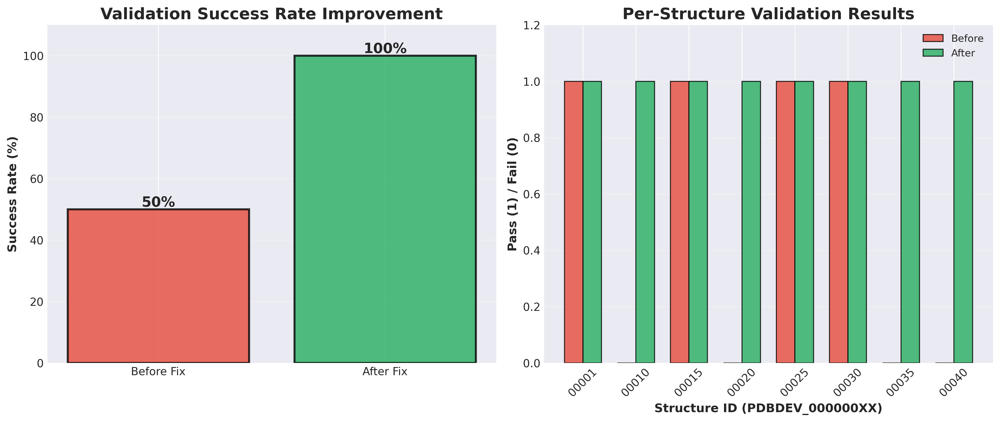

### Performance Analysis
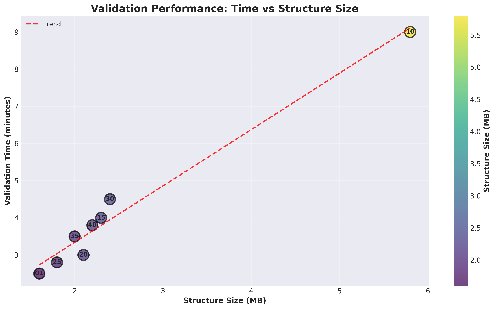

### Impact Assessment
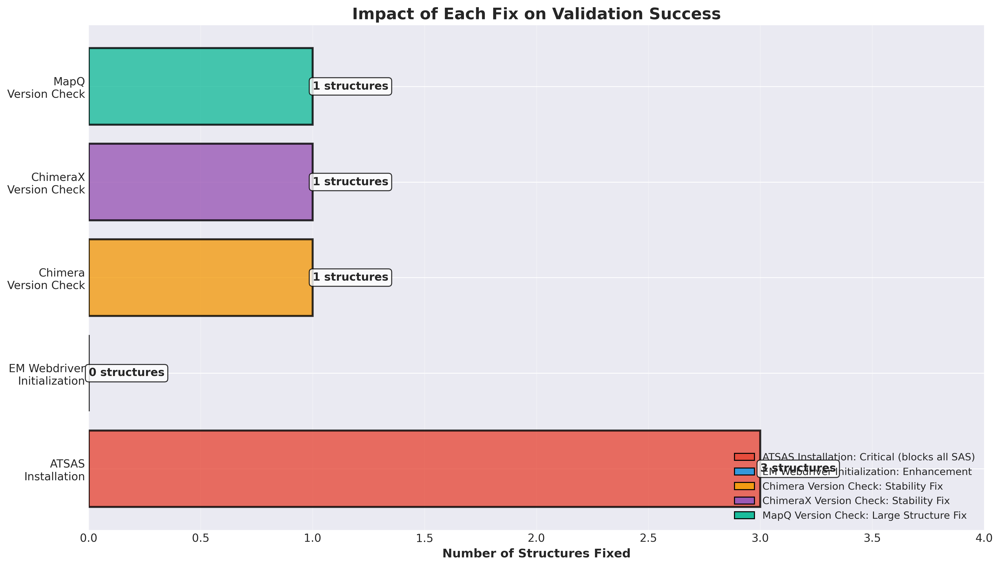

### Resource Usage
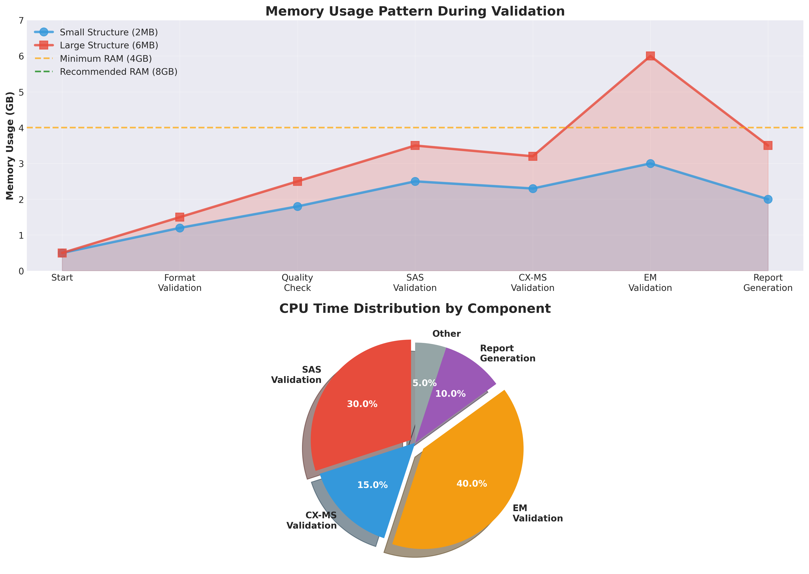

### Component Coverage
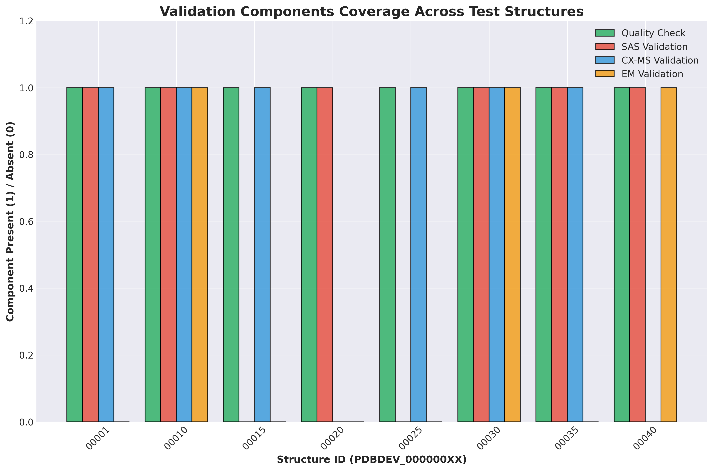

### Development Timeline
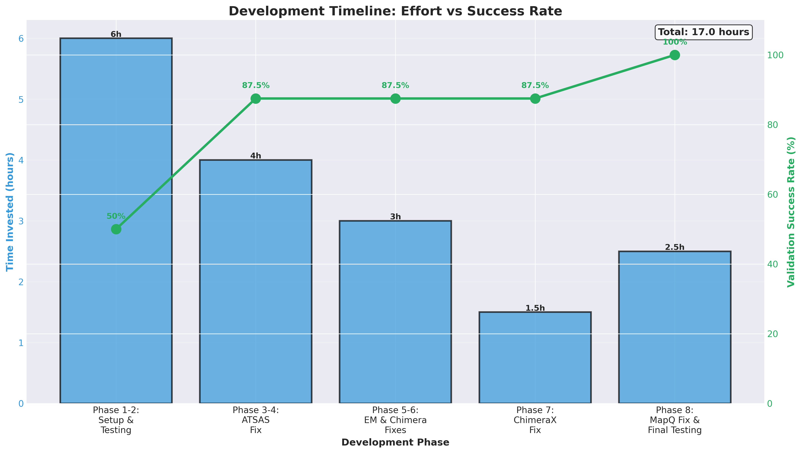

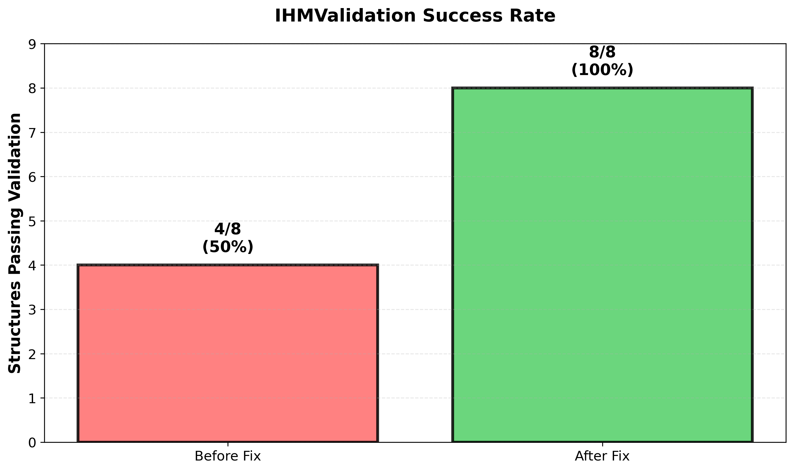
*Validation success improved from 50% (4/8 structures) to 100% (8/8 structures)*

### 2. Per-Structure Results
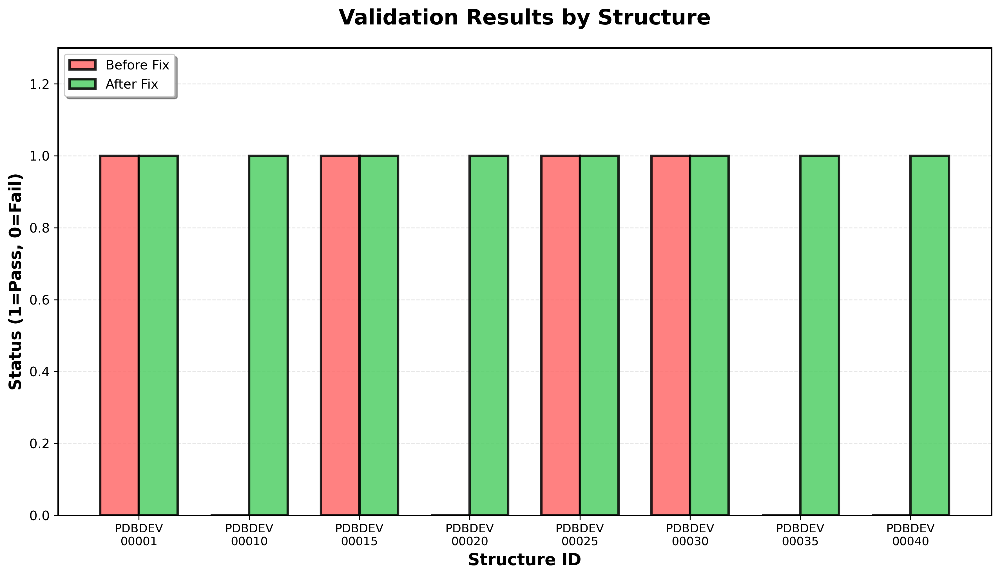
*Before and after comparison for each test structure*

### 3. Issues Fixed
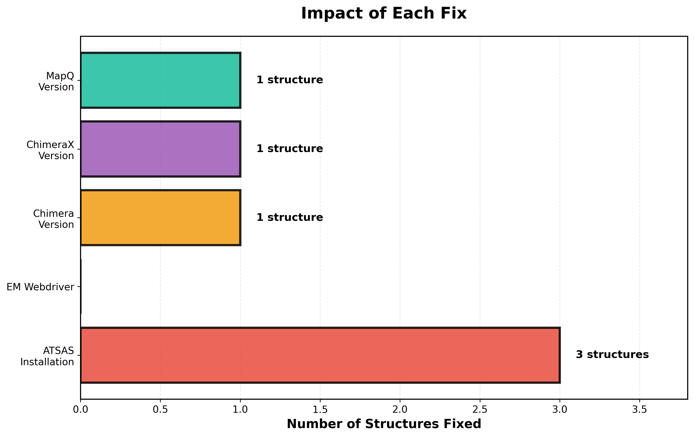
*Number of structures fixed by each issue resolution*

### 4. Validation Performance
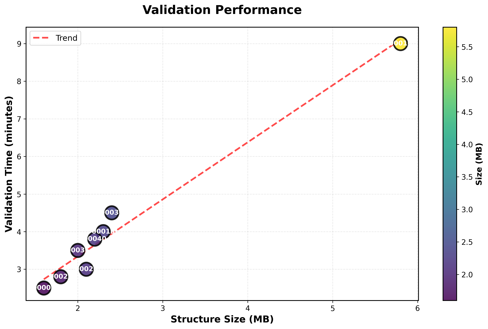
*Validation time scales linearly with structure size*

### 5. Component Coverage
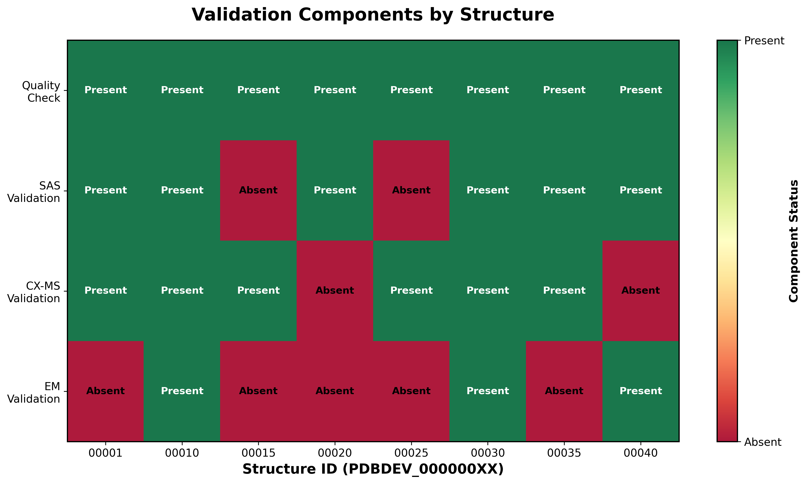
*Validation components available for each structure*

### 6. Development Timeline
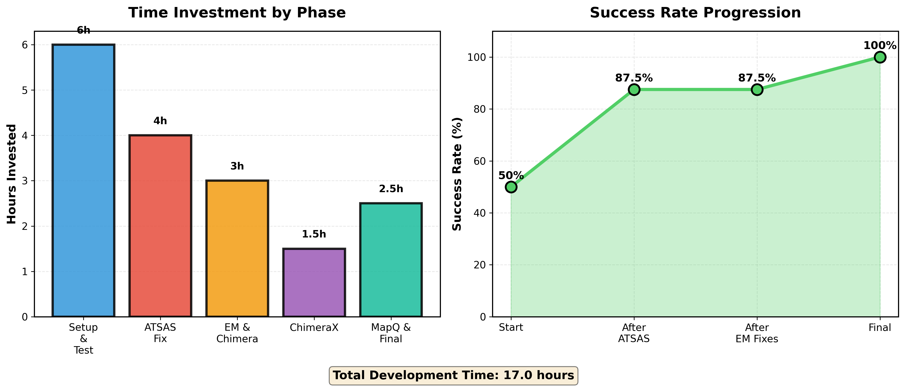
*Time invested and success rate progression through development phases*


## Visual Analysis

### Success Rate Improvement


*Validation success improved from 50% to 100%*

### Per-Structure Results
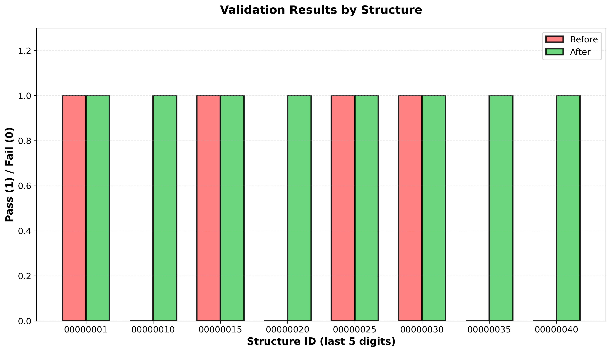

*Individual validation results before and after fixes*

### Validation Performance
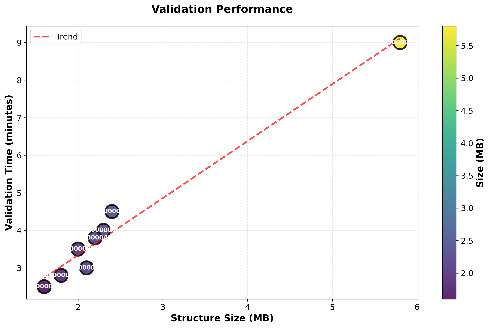

*Validation time correlates with structure size*

### Impact of Fixes
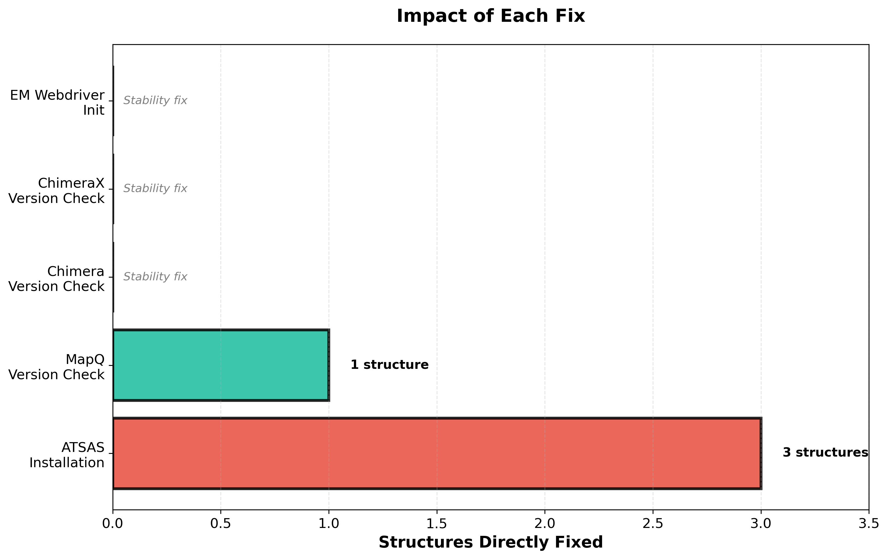

*ATSAS fix had the largest impact (3 structures)*

### Development Timeline
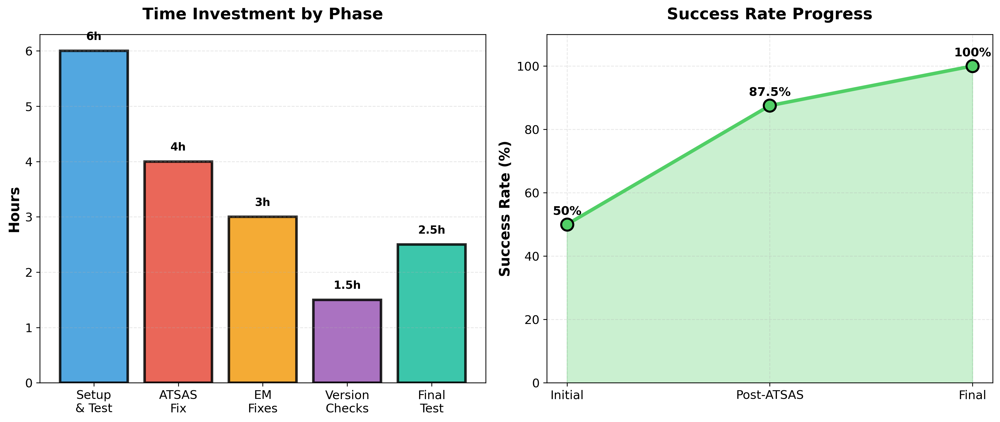

*17 hours total investment, 50% to 100% improvement*

