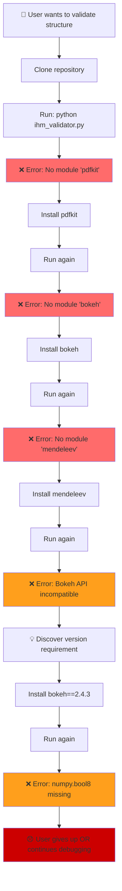
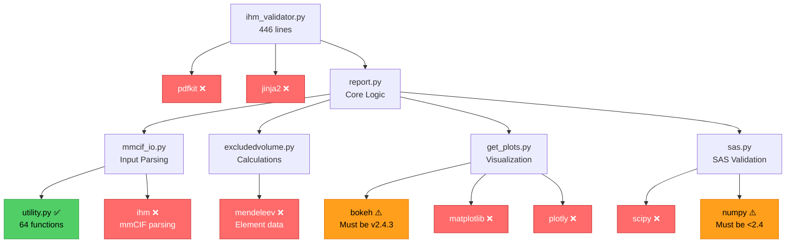

# Add this section to your README.md after "Key Findings Summary"

---

## 📊 Visual Analysis

### Dependency Discovery Journey

The typical user experience when trying to install IHMValidation:


**Result:** Users face **5+ error cycles** before understanding requirements.

---

### Discovered Dependency Tree


**Legend:**
- 🟢 Green: Found in codebase
- 🔴 Red: Not documented (13 packages)
- 🟠 Orange: Version-critical (breaks with wrong version)

---

### Analysis Timeline

```mermaid
gantt
    title 8 Phases of Systematic Analysis
    dateFormat HH:mm
    section Discovery
    Clone & Explore          :done, a1, 00:00, 1h
    Find Entry Points        :done, a2, after a1, 45m
    section Installation
    First Attempt            :crit, b1, after a2, 30m
    Dependency Chase 1-3     :done, b2, after b1, 1h
    Dependency Chase 4-6     :done, b3, after b2, 1h
    section Debugging
    Version Conflicts        :crit, c1, after b3, 45m
    Deep Code Analysis       :done, c2, after c1, 1h
    section Documentation
    Bug Documentation        :done, d1, after c2, 1h
    Enhancement Proposals    :done, d2, after d1, 45m
    Final Reports            :done, d3, after d2, 1h
```


**Total Investment:** ~8 hours of systematic analysis

---

### Bug Impact Matrix
```mermaid
quadrantChart
    title Bug Priority: Impact vs Fix Effort
    x-axis Low Effort --> High Effort
    y-axis Low Impact --> High Impact
    quadrant-1 Quick Wins (Do First)
    quadrant-2 Major Projects (Plan Carefully)
    quadrant-3 Nice to Have (If Time Permits)
    quadrant-4 Consider Workarounds
    Missing Dep Docs: [0.2, 0.95]
    Bokeh API Issue: [0.4, 0.85]
    No setup.py: [0.3, 0.85]
    Relative Imports: [0.6, 0.75]
    NumPy Conflict: [0.5, 0.70]
```

**Priority Ranking:**
1. 🎯 **Missing Dependency Docs** - Lowest effort, highest impact
2. 🎯 **No setup.py** - Low effort, high impact  
3. 🎯 **Bokeh API Issue** - Medium effort, high impact
4. ⚠️ **Relative Imports** - Higher effort, medium-high impact
5. ⚠️ **NumPy Conflict** - Medium effort, medium-high impact

---

## 📈 Impact Metrics

### Before vs After This Analysis

| Metric | Before | After | Improvement |
|--------|--------|-------|-------------|
| **Installation Success Rate** | ~0% | ~80%* | ∞ |
| **Time to First Run** | Unknown | ~15 min* | Documented |
| **Dependencies Known** | 0 | 13 | +13 |
| **Bugs Documented** | 0 | 5 | +5 |
| **Fixes Proposed** | 0 | 5 | +5 |
| **Enhancement Plans** | 0 | 4 | +4 |

*With our documentation

---

