# Analysis Journey Timeline

```mermaid
gantt
    title IHMValidation Analysis Timeline
    dateFormat HH:mm
    section Phase 1-2
    Repository Clone           :done, 00:00, 30m
    Initial Exploration        :done, 00:30, 45m
    Dependency Discovery       :done, 01:15, 60m
    section Phase 3-4
    First Installation Attempt :crit, 02:15, 30m
    pdfkit Installation        :done, 02:45, 15m
    Second Attempt             :crit, 03:00, 30m
    section Phase 5-6
    Bokeh Installation         :done, 03:30, 20m
    Mendeleev Discovery        :done, 03:50, 15m
    Import Testing             :done, 04:05, 30m
    section Phase 7-8
    Bokeh Compatibility Issue  :crit, 04:35, 45m
    NumPy Conflict Discovery   :crit, 05:20, 30m
    Documentation              :done, 05:50, 90m
```

## Key Milestones

| Time | Phase | Discovery |
|------|-------|-----------|
| 00:00 | Start | Repository cloned |
| 00:30 | Phase 1 | No setup.py found |
| 01:15 | Phase 2 | No requirements.txt |
| 02:15 | Phase 3 | First ModuleNotFound error |
| 03:30 | Phase 5 | Relative import issues |
| 04:35 | Phase 7 | Bokeh 3.0 incompatibility |
| 05:20 | Phase 8 | NumPy version conflict |
| 07:20 | Complete | All 6 goals achieved |
