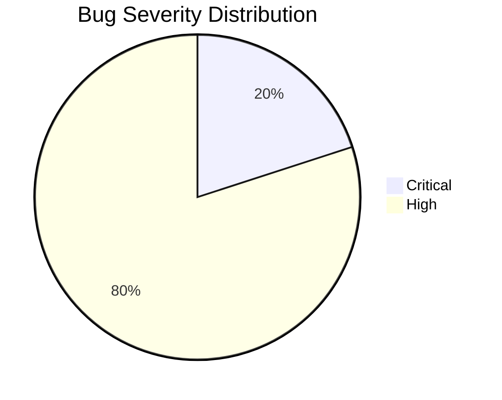
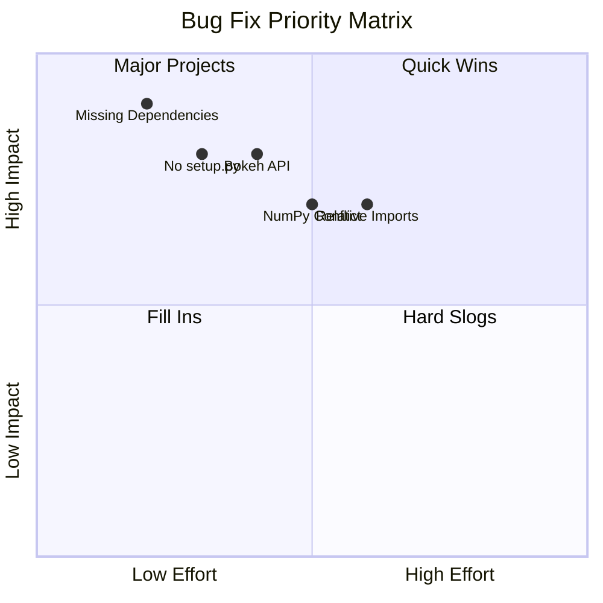
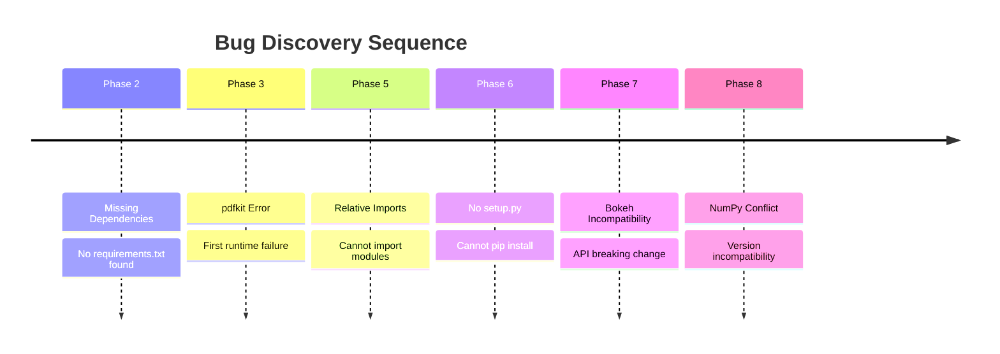

# Bug Impact Analysis

## Severity Distribution

```mermaid
pie title Bug Severity Distribution
    "Critical" : 1
    "High" : 4
```

## Impact vs Effort Matrix

```mermaid
quadrantChart
    title Bug Fix Priority Matrix
    x-axis Low Effort --> High Effort
    y-axis Low Impact --> High Impact
    quadrant-1 Quick Wins
    quadrant-2 Major Projects
    quadrant-3 Fill Ins
    quadrant-4 Hard Slogs
    Missing Dependencies: [0.2, 0.9]
    Bokeh API: [0.4, 0.8]
    No setup.py: [0.3, 0.8]
    Relative Imports: [0.6, 0.7]
    NumPy Conflict: [0.5, 0.7]
```

## Bug Discovery Timeline

```mermaid
timeline
    title Bug Discovery Sequence
    Phase 2 : Missing Dependencies : No requirements.txt found
    Phase 3 : pdfkit Error : First runtime failure
    Phase 5 : Relative Imports : Cannot import modules
    Phase 6 : No setup.py : Cannot pip install
    Phase 7 : Bokeh Incompatibility : API breaking change
    Phase 8 : NumPy Conflict : Version incompatibility
```
