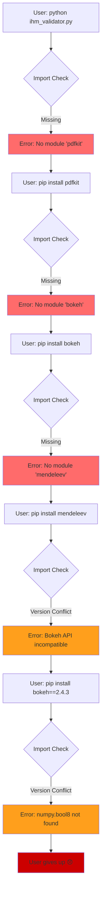
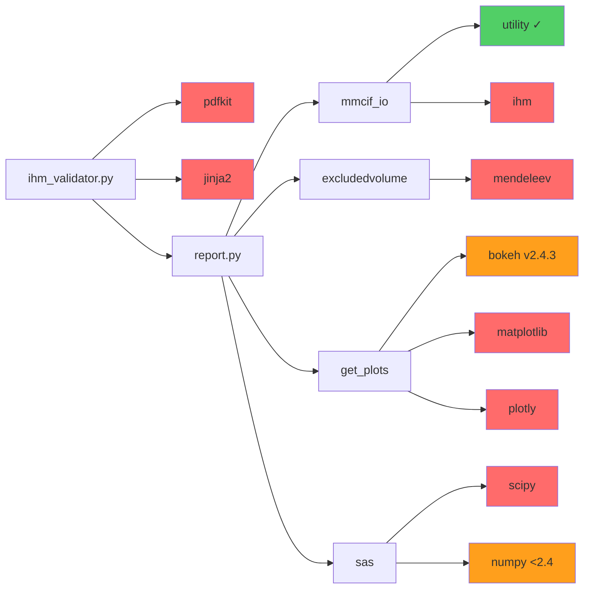

# Visual Dependency Cascade

## The User Experience: Error Chain

## Discovered Dependency Tree

**Legend:**
- 🔴 Red = Not documented (discovered through errors)
- 🟠 Orange = Version-critical (breaks with wrong version)
- 🟢 Green = Found in codebase
